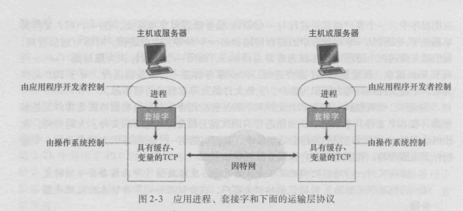

## 1：网络应用程序体系结构
Codeing之前，应当对应用程序有一个宽泛的体系结构计划。但是应用程序的体系结构是不同于网络的体系结构的。
  - 网络体系结构是固定的，为应用程序提供了特定的服务集合
  - **应用程序体系结构** 都是开发者自己来设计的，目的是规定如何在各种端系统去组织该应用程序（每个端系统的code不一样，但是整体的体系结构都是一样的）。主流的两种体系结构：1：客户-服务体系结构；2：对等(P2P)体系结构

- 客户-服务体系结构

  举个栗子：以Google为例，我去打开Google是通过浏览器（我的电脑上的）去请求的，当Google的服务器收到我这边浏览器发过去的请求的时候，Google服务器再发给我称之为响应。

  - 特点：客户的主机并不直接通信；服务器是固定的、大家都知道的IP;

- P2P体系结构

  举个栗子：QQ的面对面快传

## 2： 进程通信
端系统上的程序是如何互相通信的？在操作系统的规定中，进行通信的为进程而非程序，当进程运行在相同的端系统上的时候，他们使用进程间通信机制相互通信。这里提到的进程间通信机制的规则是由端系统上的操作系统去确定的，比如说Android关于IPC的学习和讨论是很深的。

此处仅关注运行在不同端系统上的进程间的通信，如果想了解同一台主机上的进程间通信，去补操作系统叭（难顶）

那么不同端系统上的进程间是如何通信的呢？
  - 通过跨越计算机网络交换 **报文** 相互通信。
### 2.1：客户和服务器进程
因为进程之间通信是成对的，所以要约束一下谁是客户，谁是服务器，怎么约束呢？
>在给定的一对进程之间的通信回话场景中，发起通信（即在该回话开始的时候发起与其他进程的联系）的进程被标识为客户，在会话开始时等待联系的进程是服务器

也就是我们平时说的客户端、服务器端

###:2.2：进程与计算机网络之间的接口
- 套接字(socket)
  - 进程通过socker软件接口向网络发送报文和接收报文
  - 套接字是同一台主机内应用层与运输层之间的接口
  - 套接字也称之为应用程序和网络之间的API

开发者可以控制处在应用层端的socket；但是对运输层段的控制就下面几点
   1：选择运输层协议；2：也许可以设定几个运输层参数

###:2.3：进程寻址
