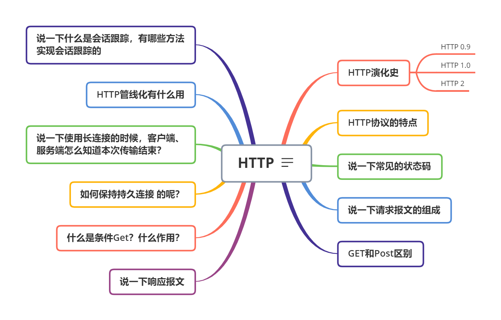
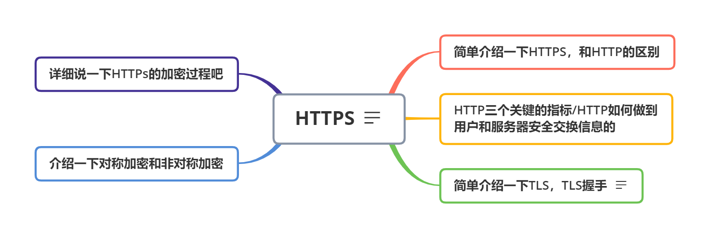
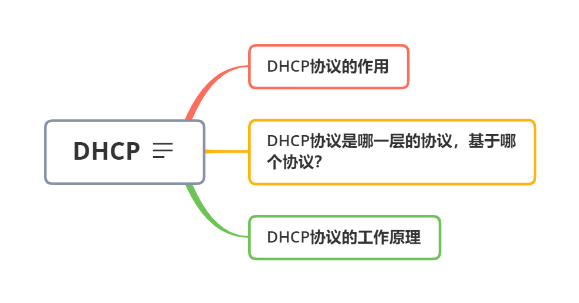
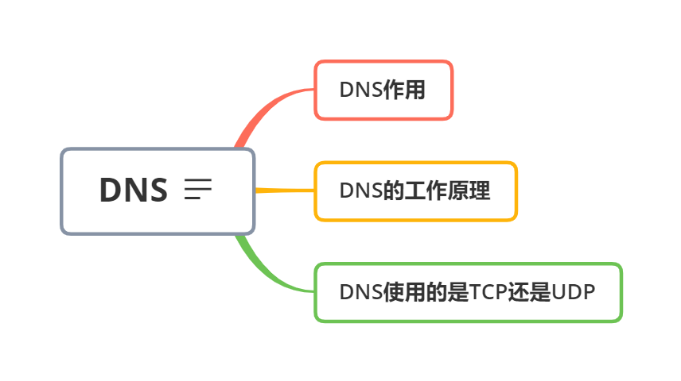
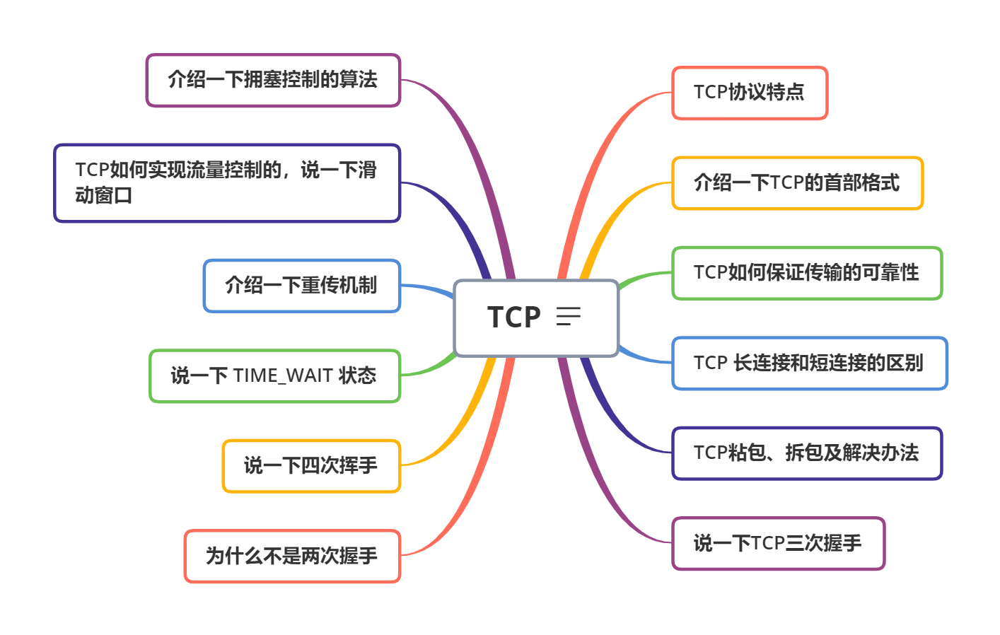
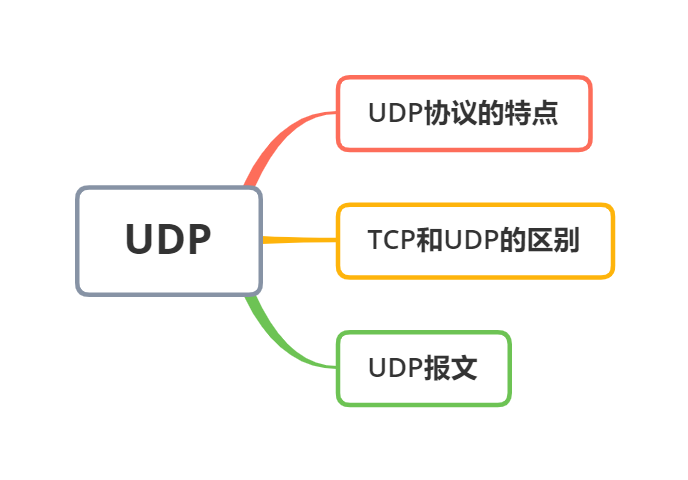
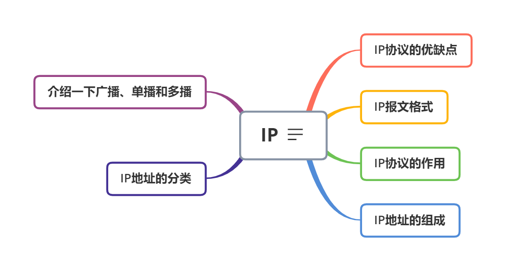
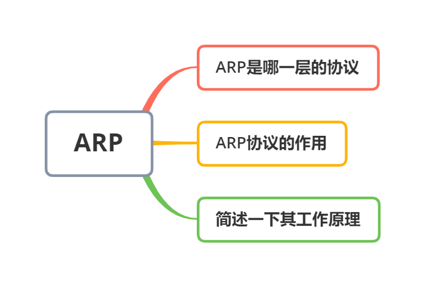

#### HTTP

关于Http：https://hit-alibaba.github.io/interview/basic/network/HTTP.html

关于Http长连接：https://segmentfault.com/a/1190000021696056

#### HTTPS

HTTPS：https://www.cnblogs.com/cxuanBlog/p/12490862.html

#### DHCP

https://blog.csdn.net/weixin_43734095/article/details/112754267

#### DNS

https://zhuanlan.zhihu.com/p/79350395

#### TCP

https://github.com/Omooo/Android-Notes/blob/master/blogs/computer_network/%E5%8F%A3%E6%B0%B4%E8%AF%9D/TCP.md

https://blog.csdn.net/qzcsu/article/details/72861891

https://hit-alibaba.github.io/interview/basic/network/TCP.html

长连接，短链接；拆包，粘包：https://zhuanlan.zhihu.com/p/108822858

https://my.oschina.net/u/4419899/blog/4277620

#### UDP

#### IP

https://zhuanlan.zhihu.com/p/56525323

#### ARP

https://blog.csdn.net/A_LINGYUAN/article/details/80036329

